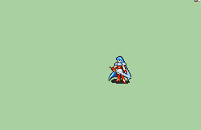

# [\[FE8 Eirika-Base\] \[F\] T1 Beta Eirika Fixed by Jono the Red](./) ) 

## Sword

| Still | Animation |
| :---: | :-------: |
|  |  |

## Credit

Original animation by IS.

Fixed versions by Jono the Red.

Fixed Missing Sword by JaidynReiman, original frames and assets from Gaiden Priestess by HyperGammaSpace, Jono. Script Adjustments (missing crit sound effect, swing sound effects) also from Gaiden Priestess.