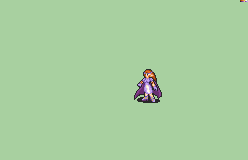

# [\[FE8 Eirika-Reskin\] \[F\] T1 Amaya by JaidynReiman](./) ) 

## Unarmed

| Still | Animation |
| :---: | :-------: |
|  |  |

## Credit

Original animation by IS.

Fixed versions by Jono the Red.

Fixed Missing Sword by JaidynReiman, original frames and assets from Gaiden Priestess by HyperGammaSpace, Jono.

Full Amaya Reskin by JaidynReiman.

Special Thanks to 7743 for Celes Chere Reskin (used as inspiration for cleanup).
