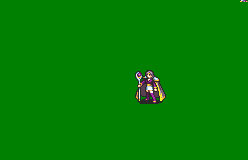

# [\[T3 Necromancer-Reskin\] \[F\] by TytheBub](./)  

## Staff

| Still | Animation |
| :---: | :-------: |
|  |  |

## Credit

F2U/F2E

6. Magic FE7 by TytheBub

6. Magic FE8 by TytheBub

7. Staff by TytheBub

The only difference between the 7 and 8 animation is the nergal aura being included in the 7 animation. the 8 one doesn't have it.
