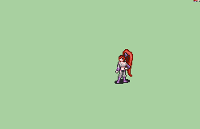

# [\[Sage-Custom\] \[F\] Harmony V2 by Stephano](./) ) 

## Magic

| Still | Animation |
| :---: | :-------: |
|  |  |

## Credit

Magistra base animation by Cynon.

Magic circle taken from Luerock's Brunya.

Kick refrenced from pixelr0gu3.

Animation by Stephano.

Stone Spell animation orginally ported by Norikins.

Elstone Spell animation orginally ported by Norikins.

Note: The 6. Magic (Earth) animation requires the Stone and Elstone magic animation installed to "make sense".
