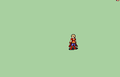

# [\[Sage-Custom\] \[F\] Magistra by Cynon](./) ) 

## Magic

| Still | Animation |
| :---: | :-------: |
|  |  |

## Credit

Animation by Cynon

Based off of the first frame of Greentea's Limstella.

Made for a specific character, so I made a more generic black eyes version and one without idle animations.
