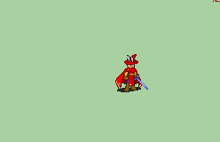

# [\[Sage-Variant\] Red Mage \[M\] by Reyk](./) ) 

## Magic

| Still | Animation |
| :---: | :-------: |
|  |  |

## Credit

F2U/F2E

Original sprite sheet by Linkain.

Animation formatting by Reyk_Retro0337.

This animation is based off the Eliwood Lord and Vanilla Sages from GBAFE.
