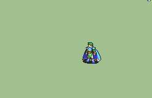

# [\[Sage-Variant\] \[M\] Mage Fighter +Weapons](./)  

## Magic

| Still | Animation |
| :---: | :-------: |
|  |  |

## Credit

F2U/F2E

Animation by Obsidian Daddy.

Scripted by StrudelMuffin Maximus03 and Obsidian Daddy.

Special Thanks to Card, Leo_Link, and Feier for helping with the still and some frame adjustments.

Another thanks to Strudel and Maximus because without those two kings I wouldn't have been motivated to finish this animation.

Play KOFXV btw
