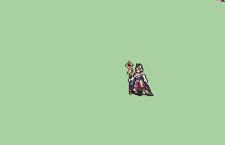

# [\[Custom Magi\] Tamamo \(FEShadows\) \[F\] by UltraFenix](./) %20%5BF%5D%20by%20UltraFenix%2F6.%20Magic) 

## Magic

| Still | Animation |
| :---: | :-------: |
|  |  |

## Credit

F2U/F2E

Animation By UltraFenix, Commissioned by Blind_Dachi

Archsage by Nuramon as base.

Niime by Daichi as base

Tail from Fox Holy Sage Brunnya, by Luerock/VelvetKitsune

Orb vfx by Steaming Tofu.

