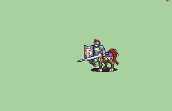

# [\[Centaur-Reskin\] \[M\] Centaur Knight by UltraFenix](./)  

## Lance

| Still | Animation |
| :---: | :-------: |
|  |  |

## Credit

F2U/F2E

Vanilla Maelduin by IS.

Armored base by Seal.

Still touch-ups by Feier.

Animation by UltraFenix. Commissioned by Chi_Chi.
