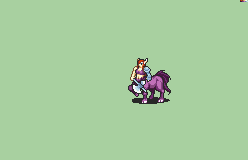

# [\[Centaur-Variant\] \[F\] CentaurZerker by Alexsplode](./) 

## Handaxe

| Still | Animation |
| :---: | :-------: |
|  |  |

## Credit

Original Femzerker made by eCut.

Made by Alexplode.

Scripting by Alexsplode.

