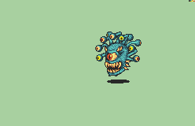

# [\[Mogall-Variant\] \[U\] Beholder by Nuramon](./)  

## Monster

| Still | Animation |
| :---: | :-------: |
|  |  |

## Credit

F2U/F2E

Still and Animations by Nuramon.

Scripts for the spells by Struedelmuffin.
