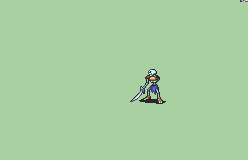

# [\[Skeleton-Base\] \[U\] Bonewalker \(one arm, sword\) by Alexsplode](./) %20by%20Alexsplode%2F1.%20Sword) 

## Sword

| Still | Animation |
| :---: | :-------: |
|  |  |

## Credit

Vanilla Skelton animation by IS.

Arm chopped off by Alexsplode.
