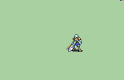

# [\[Skeleton-Base\] \[U\] Bonewalker Vanilla +Weapons]

## Credit

Vanilla animation by IS.

Axe {MrNight, RenOokami, Orihara_Saki}

Axe {Vilkalizer, Orihara_Saki}

Handaxe (Big) {MrNight, RenOokami, Orihara_Saki}

Handaxe (Slim) {Vilkalizer, Orihara_Saki}

Note that MrNight's basic Axe seems to have an issue with random pixels during the crit. Vilk's is probably better.

Their handaxes have their own merits.
	
## Axe

| Still | Animation |
| :---: | :-------: |
|  |  |
