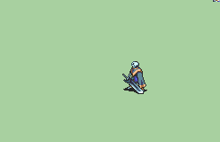

# [\[Skeleton-Custom\] \[U\] Specter by Alexsplode](./)  

## Sword

| Still | Animation |
| :---: | :-------: |
|  |  |

## Credit

Vanilla Shaman animation by IS.

Vanilla Sage animation by IS. 

Vanilla Skelton animation by IS.

Specter animation by Alexsplode.

Scripting by Alexsplode.

Map sprites and mug edited by Alexsplode.
