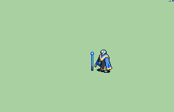

# [\[Skeleton-Variant\] \[U\] Skeleshaman \(Lich\) by Dutch Introvert](./) %20by%20Dutch%20Introvert%2F7.%20Staff)

## Staff

| Still | Animation |
| :---: | :-------: |
|  |  |

## Credit

Shaman base by IS.

Staff/Unarmed animations by An odd Dutch Introvert
