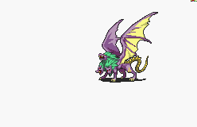

# [\[Wolf-Reskin\] \[U\] Winged Cerberus by Pikmin1211 +SM Crit](./) 

## Magic

| Still | Animation |
| :---: | :-------: |
|  |  |

## Credit

Made by Pikmin1211.

This animation is based on Watching Dog's Vampirehound animation. The idea is to create a Tier 3 animation for the Hellhound and Gwyllgi.

Attacks previously put wing in front of enemy unit. This has been edited by Craigrandall55 (CR55).

Magic Animation put together by Craigrandall55 (CR55). 

Wing Flap Smear during Magic Crit by Vilk (Thank you Vilk).

