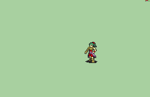

# [\[Wolf-Variant\] \[F\] Kitsune Rogue by DATonDemand](./) 

## Monster

| Still | Animation |
| :---: | :-------: |
|  |  |

## Credit

Fem Rogue repaletting, transformation frames (000-004) & Scipt Modifications by DATon Demand.

Fem Rogue base sprite & Unarmed animations Made by {Temp, Black Mage, Wan}.

Gwyllgi Frames & original frame scripting by ZoramineFae.
