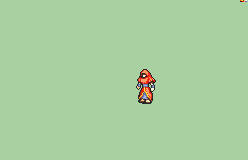

# [\[Manakete-Base\] \[U\] Generic Dragon Transformation](./) 

## Unarmed

| Still | Animation |
| :---: | :-------: |
|  |  |

## Credit

Animation by EldritchAbomination.

This animation is made so that, with the addition of all the new dragons in the Repo, animators can use this as a base to make other transforming manaketes. It's easily recolorable, too!
