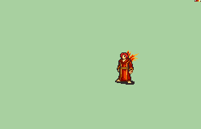

# [\[Manakete-Reskin\] \[M\] Fire Dragon Jahn by UltraFenix](./)  

## Unarmed

| Still | Animation |
| :---: | :-------: |
|  |  |

## Credit

F2U/E

IS.
FE7 Dragon port by (Dragonstone, Flash Crit and Stepin) by SHYUTERz.
Manakete form from Morva animation by Cipher Lee, port by DerTheVaporeon.
Fire VFX:
Vortex from Blast Golem animation, by Alexplode.
Edit Fire Circle from Vanilla FE6 Dragon.
Fireball falling and explosion edit sprites from the MegaMan X4, ZX and ZX Advent games.
FE7 Dragon Repal by UltraFenix.
Jahn Reskin by UltraFenix and Alice.
