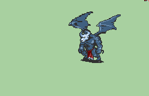

# [\[Monster Custom\] \[M\] Minotaur \(Archdemon\)](./) %2F8.%20Unarmed) 

## Unarmed

| Still | Animation |
| :---: | :-------: |
|  |  |

## Credit

F2U/F2E

Animation by Alexsplode.

Demon and Archdemon edits by Idrees Shah. https://www.fiverr.com/idreesshah11

commissioned by Mightyappa.

Note: If you wanted a T2 recolored version, this code gives an alternate palette: 5553984235326F15CA04562990102C041F00FF7FDA2A32526E4D6B31C618A514
