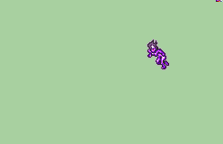

# [\[Monster-Custom\] \[F\] Ghostgal by Stephano](./) ) 

## Transform

| Still | Animation |
| :---: | :-------: |
|  |  |

## Credit

Animation by Stephano.

Character by WayForward.

Elements used from Nuramon's Witch Nuibaba.

Demonstration animation sprite is Nuramon's Zelgius Marshal.

(Note: Visit here for more information of how the possession animation works: https://feuniverse.us/t/fire-emblem-resource-repository-battle-animations-portraits-music-etc/3326/5727.) 
