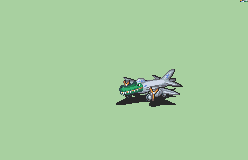

# [\[Monster-Custom\] \[U\] Bombardino Crocodilo by LucaYoshi](./)  

## Monster

| Still | Animation |
| :---: | :-------: |
|  |  |

## Credit

F2U/F2E

All attacks call the spell from the weapon, I suggest you to Download the "Explosion(MetalSlug)" I uploaded in the "Other" category of "Spells and Skills"

Sprites and code by LucaYoshi

