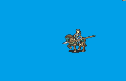

# [\[Cavalier-Variant\] \[F\] Generic Vanilla by SALVAGED](./)  

## Lance

| Still | Animation |
| :---: | :-------: |
|  |  |

## Credit

F2U/F2E

Original Cavalier: Team SALVAGED

Female Variant: Team SALVAGED, CelestiaHeart

Magic Axe: CelestiaHeart

Note: This animation uses the SALVAGED based design but uses vanilla motions.

Note2: Use the female SALVAGED Cavalier edit for Bow and Unarmed animations. This is just for the melee attack motions.
