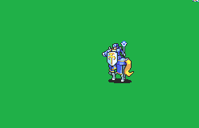

# [\[Paladin-Base\] \[M\] Vanilla +Weapons](./)  

## Staff

| Still | Animation |
| :---: | :-------: |
|  |  |

## Credit

Vanilla animation by IS.

Bow {ltranc, Genocike, Kao, DerTheVaporeon}

Magic {Primefusion}

Magic (SaintRubenio) by SaintRubenio and credit to Primefusion.

Staff {Primefusion}

Axe (With Handaxe) was combined by Seliost1.

Sword (Durandal) by Tatata.

Axe (Armads) by Tatata.

Unarmed (Mount only) by tatata.
