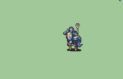

# [\[Paladin-Variant\] \[F\] SALVAGED Vanilla](./)  

## Staff

| Still | Animation |
| :---: | :-------: |
|  |  |

## Credit

F2U/F2E

Original Paladin: Team SALVAGED

Female Variant: Team SALVAGED, Leo_link, Flasuban, The_Big_Dededester

Bow Animation: Obsidian Daddy

Magic and Staff: CelestiaHeart

Note: This animation uses the SALVAGED based design but uses vanilla motions.

