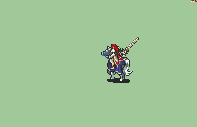

# [\[Paladin-Variant\] \[F\] SALVAGED-Style Titania](./) 

## Sword

| Still | Animation |
| :---: | :-------: |
|  |  |

## Credit

This animation is based on the SALVAGED Female Paladin, made by Team SALVAGED.

The Titania Variant was made by Victor Pouderoux.
