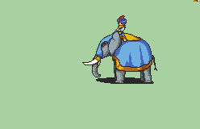

# [\[Cavalry-Custom\] \[U\] Updated Grand Mahout by Orihara_Saki, DatonDemand](./)  

## Monster

| Still | Animation |
| :---: | :-------: |
|  |  |

## Credit

Original Mahout Rider animations, Elephant Sprite & Sound effect by Orihara_Saki,SHYUTERz, CamusZekeSirius

Lance by DATonDemand.

Monster by DATonDemand.

Bow by DATonDemand.

Scripting done by Sable Mage

-----------------------------------------------------------------------------

About this animation:

~~~~~~~~~~~~~~~~~~~~~~~

This animation uses a custom sound effect for the crits. To get it properly running do these steps:

1. Make sure SOX is set up in builder. If you haven't go to settings then "initial set up wizard" you will then be able to download and use SOX

2. Go to the Song table menu

3. Import the Sound effect "elephant 2" to "slot 015C". This is the slot used in the script of the animations 

-> (you can put the sound effect in any empty slot but this will require you to change the script)

4. Choose Lowest2 (SFX) in the priority (PlayerType) menu then write to rom.

-----------------------------------------------------------------------------

