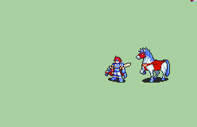

# [\[FE7 Eliwood-Reskin\] \[M\] Dismounted T2 Roy \(Binding Blade\) by ToGY, \[unknown\]](./) %20by%20ToGY%2C%20%5Bunknown%5D%2F8.%20Sword%20(Binding%20Blade)) 

## Sword

| Still | Animation |
| :---: | :-------: |
|  |  |

## Credit

F2U/F2E

Someone on feu discord shaded Eliwood's Knight Lord horse saddle but I can't access that now so :/
