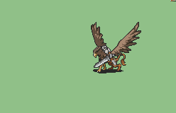

# [\[Griffon\] \[U\] Griffon v2 SoA by Ayr](./)  

## Sword

| Still | Animation |
| :---: | :-------: |
|  |  |

## Credit

Hi! Ayr here. You probably don't know me, but I made this animation for use in the romhack Staff Of Ages.

(Thanks for actually reading the readme)

Here's the Griffon Knight anim you downloaded that you probably want to use in your hack!
 
Just a quick note, if you plan to release your hack out for the public to play, please be sure to credit me somewhere in your hack and on the hack's download page/wherever your credits are. So long as you do that, this anim is free for you to use! If you don't credit me though, I might bug you about it, and nobody wants that.

Thank you!
