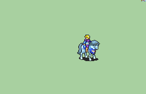

# [\[Troubadour-Reskin\] Deacon Repalette \[M\] by UltraFenix](./)  

## Unarmed

| Still | Animation |
| :---: | :-------: |
|  |  |

## Credit

F2U/F2E

Deacon base animation by GabrielKnight.

Female Troubadour Repalette by BatimaTheBat.

The animation and Troubadour Repalette were merged by EldritchAbomination.

Original Sword Animation by TBA, edit by Pikmin1211.Extra frames from Sword Cavalier by Leo_Link

Alt Repal By UltraFenix.

